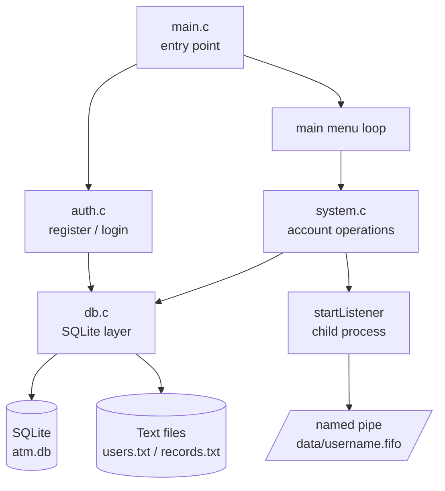
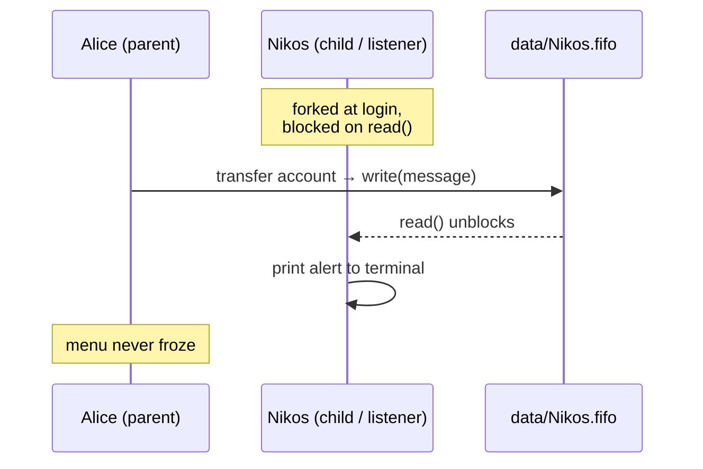

# ATM Management System (C)

A terminal-based ATM management system written in C. It handles user
registration and login, full account management, transactions with
interest logic, and **real-time transfer notifications between concurrent
processes**. Data is persisted to a SQLite database (mirrored to text
files), and passwords are stored as salted SHA-256 hashes.

Built solo, from scratch, as part of the [Zone01](https://zone01.gr)
curriculum — starting with zero prior C experience.

> **Status: complete.** All core features and all five bonus features are
> implemented: custom Makefile, TUI, password encryption, SQLite
> persistence, and real-time notifications via `fork()` + named pipes.

---

## Table of contents
- [Features](#features)
- [Architecture](#architecture)
- [How notifications work](#how-notifications-work)
- [Security model](#security-model)
- [Requirements](#requirements)
- [Build & run](#build--run)
- [Data storage](#data-storage)
- [Project structure](#project-structure)
- [Challenges & what I learned](#challenges--what-i-learned)

---

## Features

- **Register / Login** — unique usernames, credential validation, masked
  password input
- **Create / List accounts** — per-user account management
- **Account details** — with interest calculation by account type
- **Update account** — phone / country
- **Transactions** — deposit / withdraw with balance validation
- **Remove account**
- **Transfer ownership** — reassign an account to another user
- **Real-time notifications** — when an account is transferred to you, an
  instant alert appears in your terminal if you're logged in

### Account types & interest
| Type | Rate | When |
|---|---|---|
| current | 0% | No interest |
| savings | 7% | Monthly, on deposit day |
| fixed01 | 4% | After 1 year |
| fixed02 | 5% | After 2 years |
| fixed03 | 8% | After 3 years |

`fixed` accounts are locked — no withdrawals or deposits allowed.

### Bonus features
| Feature | Status |
|---|---|
| Custom Makefile | ✅ Done |
| TUI (colors, borders) | ✅ Done |
| Password encryption (SHA-256 + salt) | ✅ Done |
| SQLite database | ✅ Done |
| Real-time transfer notifications (pipes + fork) | ✅ Done |

---

## Architecture

The codebase is split by responsibility, with all persistence flowing
through a single data layer — which made the later migration from flat
files to SQLite possible without rewriting the feature code.



Every feature (create, transaction, transfer, etc.) reads and writes only
through the data layer in `db.c`, never touching storage directly. This
abstraction is what let SQLite slot in underneath without changes to the
menu logic.

---

## How notifications work

This is the most technically involved part of the project — real
inter-process communication.

On login, the program calls `fork()`, splitting into two independent
processes:

- The **parent** runs the interactive menu, exactly as before.
- The **child** creates a per-user named pipe (FIFO) at
  `data/<username>.fifo` and blocks on `read()`, waiting for messages.

When another user transfers an account to you, the sending process opens
your FIFO and writes a short message into it. Your child process — which
has been waiting this whole time — reads it and prints the alert
instantly, while the parent keeps serving the menu, completely
uninterrupted. The two run **concurrently and independently**; neither
blocks the other.



**Offline recipients** are handled gracefully: the sender opens the FIFO
with `O_NONBLOCK`, so if no listener exists, the write is skipped instead
of freezing the sender. The transfer itself still completes and is saved —
the notification is a live bonus, not a requirement for the transfer to
succeed. The recipient sees the change on their next login.

---

## Security model

Passwords are never stored in plain text. On registration:

1. A random **salt** is generated per user.
2. The password is hashed with **SHA-256** over `salt + password`.
3. The stored value is `salt:hash`.

On login, the same salt is re-applied to the entered password and the
result compared to the stored hash — the plaintext is never recoverable
from storage. Pre-existing plaintext users are upgraded automatically by a
one-time, idempotent migration on startup.

---

## Requirements
- GCC / any C compiler
- `make`
- `libsqlite3-dev` (SQLite is linked at build time via `-lsqlite3`)
- A POSIX system (Linux / macOS) — uses `fork`, `mkfifo`, and pipes

On Debian/Ubuntu:
```bash
sudo apt install libsqlite3-dev
```

## Build & run
```bash
make        # compiles
./atm       # runs the program
make clean  # removes binary
```

To see notifications in action, open **two terminals**, log in as two
different users, and transfer an account from one to the other — the alert
appears instantly in the recipient's terminal.

---

## Data storage

Data is persisted to a SQLite database (`data/atm.db`) and mirrored to
text files for backward compatibility:

- `users.txt` — `{id}|{name}|{salt:hash}`
- `records.txt` — `{id}|{user_id}|{username}|{account_id}|{date}|{country}|{phone}|{balance}|{type}`

A one-time, idempotent migration copies any pre-existing text-file data
into the database on startup, so existing users stay valid across the
switch to SQLite.

Per-user FIFO files (`data/<username>.fifo`) are created at runtime for
notifications and are not part of the stored data.

---

## Project structure
```
.
├── data/
│   ├── atm.db          # SQLite database
│   ├── records.txt
│   └── users.txt
├── Makefile
└── src/
    ├── auth.c          # register, login, password masking
    ├── db.c            # SQLite layer (CRUD, migration)
    ├── header.h        # structs, function declarations, includes
    ├── main.c          # entry point, main menu loop
    └── system.c        # account operations, notification listener
```

---

## Challenges & what I learned

**Starting from zero C.** This was my first C project. Beyond syntax, the
real shift was thinking about memory, pointers, and manual resource
management (files, processes) with no runtime holding my hand.

**A data abstraction that paid off.** Early on I funnelled all persistence
through `loadAllRecords` / `saveAllRecords`. When the SQLite bonus came, I
could swap the storage backend underneath without touching feature code —
a concrete lesson in why decoupling storage from logic matters.

**Password hashing.** Implemented salted SHA-256, learned why the salt is
stored alongside the hash (to re-verify without ever decrypting), and why
a fixed-length hash makes buffer sizing predictable. Writing an
*idempotent* migration — safe to run on every startup — was its own
lesson.

**Inter-process communication (the big one).** The notification feature
meant building real concurrency from first principles:
- `fork()` — that a child is a *copy* of the parent, not a share; that
  both continue from the line after `fork()`; and that the return value
  (child PID to the parent, `0` to the child) is how they tell themselves
  apart.
- **Named pipes (FIFOs)** — that a blocking `read()` is exactly what a
  listener wants, and precisely why the listener must live in a separate
  process: a blocking read in the only process would freeze the whole app.
- **Non-blocking I/O** — using `O_NONBLOCK` on the writer side so a
  transfer to an offline user degrades gracefully instead of hanging.
- **Robustness** — reopening the FIFO on EOF to avoid a busy-loop, and
  checking `errno`/`EEXIST` so re-creating an existing pipe isn't treated
  as an error.

**Portability.** Learned to `#include` every header I depend on directly
(e.g. `sys/types.h`) rather than relying on transitive includes — the kind
of thing that compiles on one machine and breaks on an older one.

## License
Built as part of the [Zone01](https://zone01.gr) curriculum.